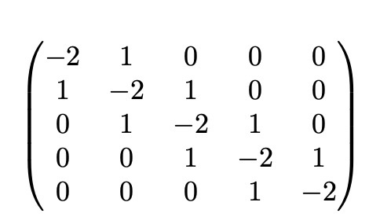

## Matrix Utils for NUMBAS

This is mostly me messing about with the extension system, but it also serves a purpose as I'm unable to find the functions I write here.

### `create_diag`

Creates a zero `row` by `cols` matrix, the calls `fill_diag` using the `values` and `offset` parameters.
### `fill_diag`

Takes a matrix and fills the diagonals as defined. The parameters are:

* `matrix`: the matrix to fill (note that it is not copied)
* `values`: An array of numbers that is the same size the the one specified in `offset`
* `offset`: An array of numbers indicating where the diagonals should be filled relative to the leading diagonal, with a positive number indicating a right shift.

Take, for example, a 5x5 zero matrix, called `matrix`. Using the following function:

```javascript
fill_diag(matrix, [1, -2, 1], [-1, 0 ,1]);
```

`matrix` will be modified to look like this:



### `determinant`

Takes a matrix and returns it's determinant. Does not have a restriction on the size, as long as the matrix is a square.